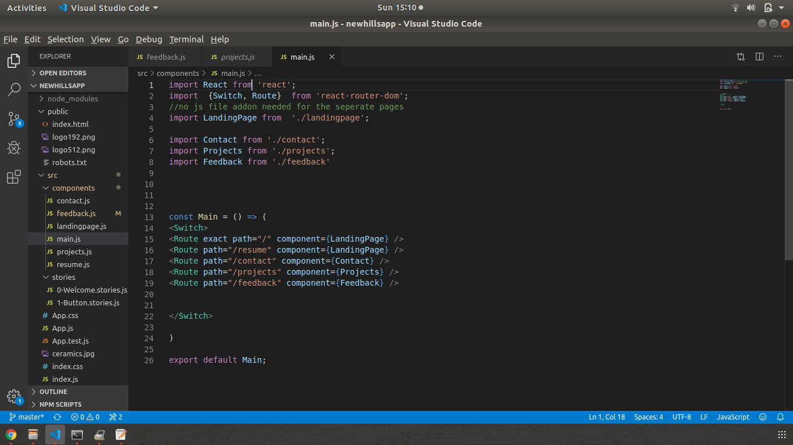
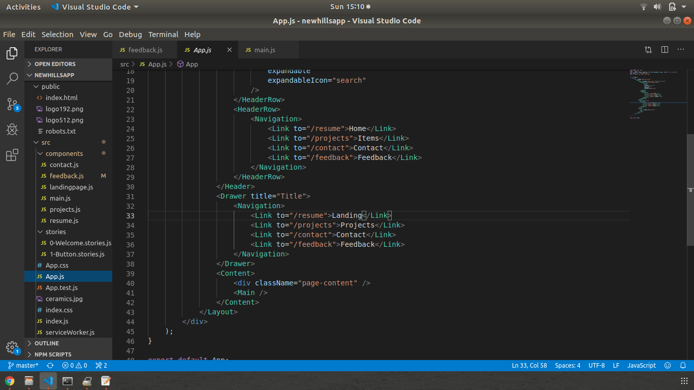
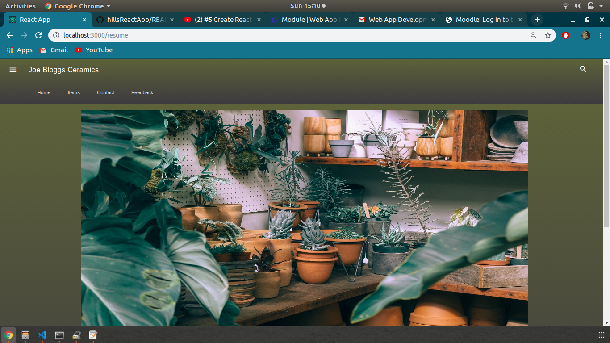
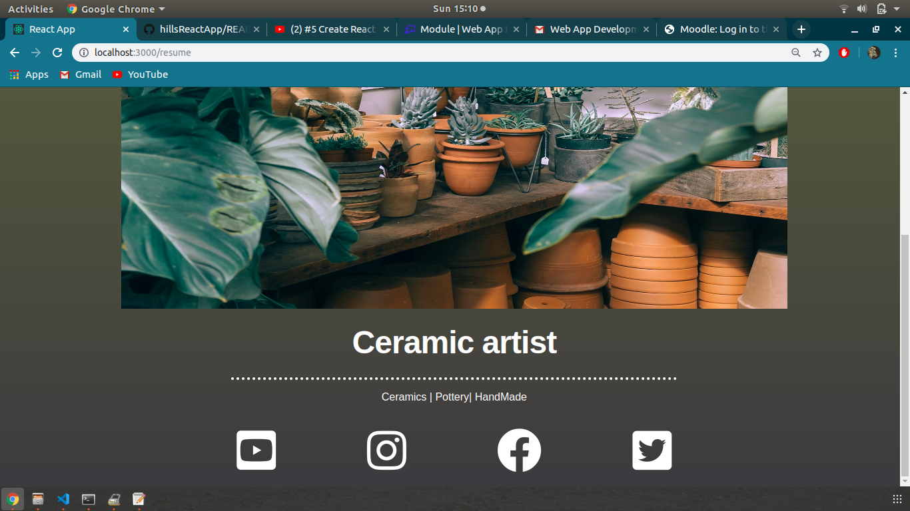
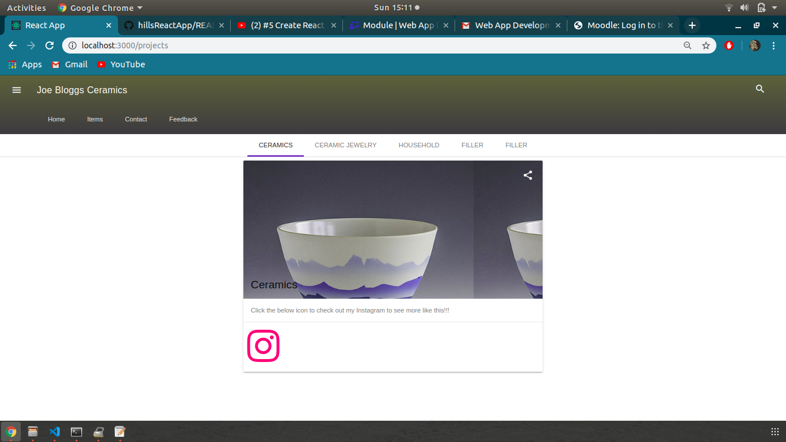
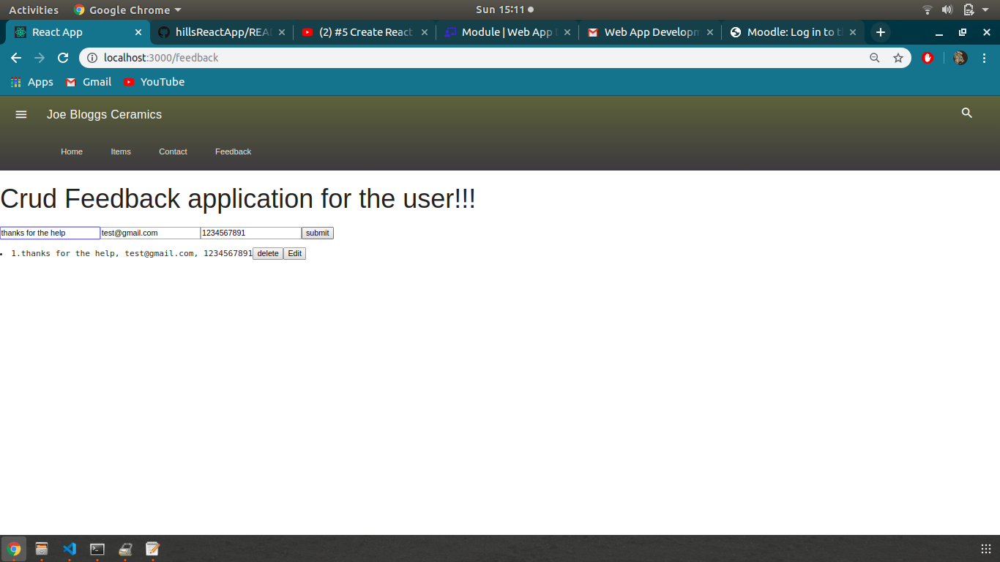
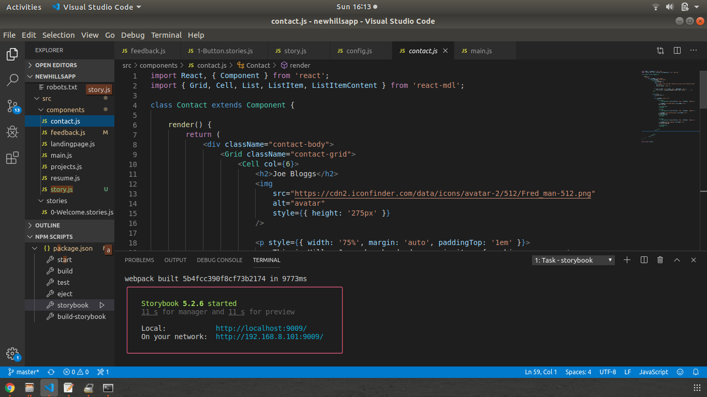

# Project Title
Ewan Hills React application for a ceramics producer.

## Overview
Hyperlinking.

full react design.

routing and linking between all pages.

side table bar for navigation.

top header for navigation.

showcase for ceramic items with links to business owners account, instagram homepage as a placeholder for now.#

Logos such as youtube which will bring you to owners selected social media account, again youtube homepage as placeholder

logo support for twitter, instagram, youtube, facebook.

Full CRUD feedback support for customers/owner

Deployed via Netify.

Contact page with placeholder image as a test, can be changed as selected later on.


## Getting Started

These instructions will get you a copy of the project up and running on your local machine for development and testing purposes. See deployment for notes on how to deploy the project on a live system.

### What the application can do!!!

## Routing




This is a react applcation with storybook, this website can do the following.

*Has extensicve hyperlinking the user can add their own social medias to the internal code, when an icon is clicked such as instagram it will bring the viewer directly to their account via a new tab.

*Intuiative interface eg home with logo linked hyperlinks




*Has support for storybook

*Area for item addition for the store front


*full CRUD support so the user can leave comments for the business owner.
*The user can leave his/her email, name and number this data is stored in an array, it can later be edited or removed from the list if needed.



*Deployed via Netify.

*Storybook support



### Installing

A step by step series of examples that tell you how to get a development env running

Say what the step will be

```
See if node.js is installed by typing "node -v"
if node.js is not installed follow these instructions 

for UBUNTU/LINUX       https://docs.npmjs.com/cli/install
for WINDOWS machines   https://yarnpkg.com/lang/en/docs/install/#debian-stable
```


End with an example of getting some data out of the system or using it for a little demo

## Running the tests

Download the repo, go into the newhillsreatapp, then open a terminal.

If your using windows type "yarn run"

if on Ubuntu/Linux type "npm run"


## Built With

* Help from labs
* Help from the following playlists "https://www.youtube.com/watch?v=Ej3VPf-BrYM"
* CRUD help from "https://www.youtube.com/watch?v=HZkN0LfC5dM&list=PLjW0UGS7gVqd9_BfJBkGAEUguPBeJ-LcE&index=2&t=0s"


## Versioning

I used to Netify "https://www.netlify.com/" an all in one platfrom tool to host my website.

